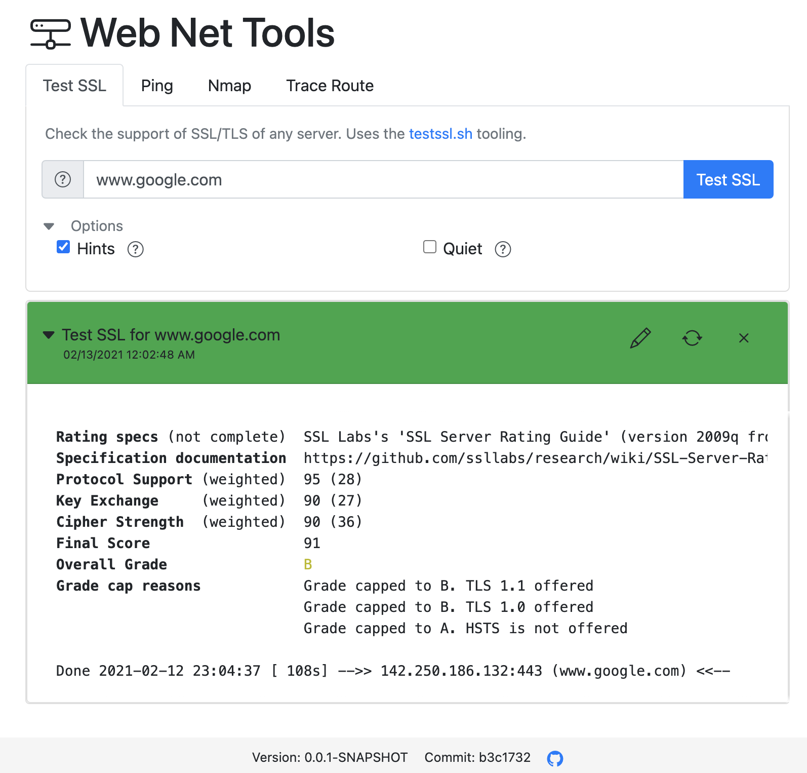
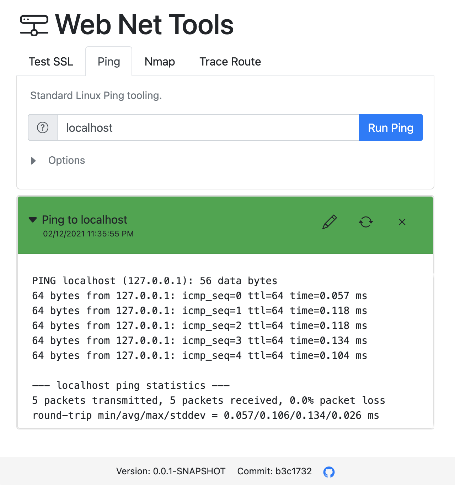

# Web Net Tools

Web Net Tools is a web frontend for some useful command line tooling. It provides especially an web frontend for tools like testssl.sh and nmap.
Currently it support the following tools:
* Ping
* Traceroute
* [Nmap](https://nmap.org)
* [testssl.sh](https://github.com/drwetter/testssl.sh)

<p align="center">
  
  
</p>

Web Net Tools is a ready to use Docker image. No additional setup of the mentioned tools is needed.

## Demo

A live demo is available under https://web-net-tools.herokuapp.com.
The demo has a rate limit for each tool to avoid abuse of it.   

## Main usage

This tool was made to make command line tools available in closed networks.
Especially the tool testssl.sh has currently no web frontend and similar tools
in the public internet can't be used in close private networks. Web Net Tools
can help you to make such services available for easy use.

## Usage

Simple run the following Docker command:
```
docker run -p 8080:8080 --name webnettools johannesschafer/webnettools:1.0.0
```

## Configuration options

Currently you can configure the following aspects

* Available tools - set the Docker environment variable `AVAILABLE_TOOLS` with an set of the following tools to limit the tools shown in the web frontend: `testssl`, `ping`, `traceroute`, `nmap`. E.g. `AVAILABLE_TOOLS=testssl,nmap`.

* Rate limit - Limits the number of calls of a specific tool to a specific target (e.g. host). The value is set in milliseconds between consecutive calls. E.g. set Docker variable `RATE_LIMIT=60000` to limit the calls to one per minute.

* To set additional certificates for the testssl.sh tool, just map the folder with the certificates to the container folder /certs. E.g.
```
docker run -p 8080:8080 -v ./localfolderwithcerts:/certs --name webnettools johannesschafer/webnettools:0.0.1-SNAPSHOT
```

* Intro text - set the Docker environment variable `INTRO_TEXT` to show an additional paragraph in front of the tool selection. This can be used to help the users in your specific environment. HTML tags are supported.

## Extension

To add own tools you have to create an clone or fork of this repository and create an 
payload class for your tool. Via Java annotations to your parameter fields, all
settings for an tool are done.

E.g.

```java
import io.github.johannesschaefer.webnettools.annotation.*;
import lombok.Data;

@Data
@Tool(name="demo", displayName = "Demo", cmd="echo", description="Demo for the tooling.")
public class DemoPayload implements Payload {
    @MainParameter(displayName ="Main", description="Main parameter for this tool.")
    private String main;

    @NumberParam(displayName ="NumInt", param="num-int", description="number integer demo ", min=0., max=100., step=1.)
    private Integer numInt = 50;

    @NumberParam(displayName ="NumDouble", param="num-double", description="number double demo ", min=0.1, max=99.9, step=.1)
    private Double numDouble = 66.6;

    @StringParam(displayName ="String", param="string", description="String demo", paramType = ParameterType.EQUALS)
    private String string;

    @BooleanParam(displayName ="Bool", param="bool1", description="boolean demo")
    private Boolean bool;

    @EnumParam(displayName = "color", param = "--color", description="color selection")
    private Color color;
}
```

Please check the existing payload under /src/main/java/io/github/johannesschaefer/webnettools/payload for more examples.
